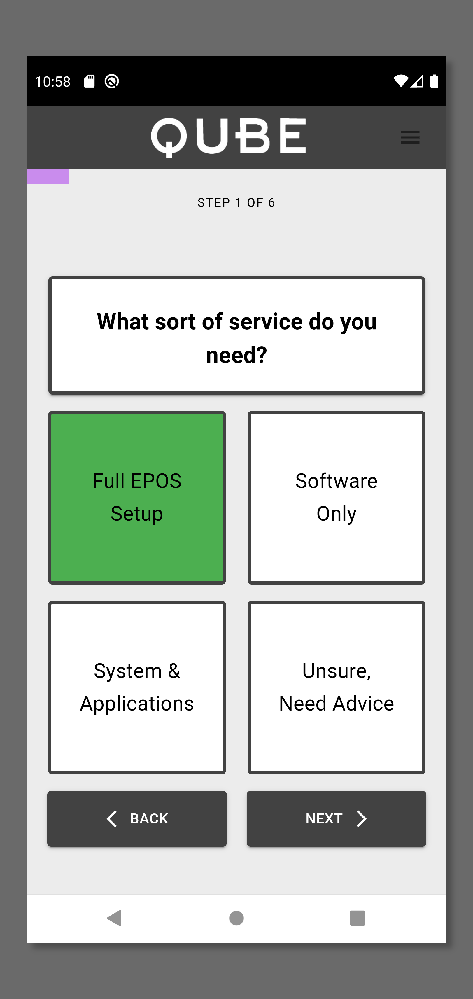
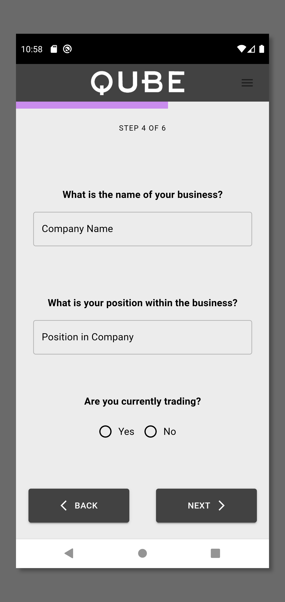

<h1 align="center">
  EPoS Questionnaire
</h1>

  Built with ❤︎ 

<h2 align="center">
  Introduction
</h2>

This application is intended to generate potential sales leads for a company specialising in the sales and aftersales of Electronic Point of Sale hardware and software.

<h2 align="center">
  Notable Features
</h2>

-   JWT Authentication
-   User registration and login
-   Portal for company members to view / sort leads
-   Validation

<h2 align="center">
 What else ?
</h2>

-   Fully built API using RESTful principals, allowing for:
    -   Full CRUD functionality on submitted results, routes protected using authentication
    -   User registration
    -   User Login
    -   Hashed passwords
    -   Password reset request - Sends a hashed token to registered email address, along with generated URL used to reset password.
        This URL and token expires in 10 minutes.
-   Implemented API security measures
    -   rate-Limiting
    -   XSS prevention
    -   Prevent No-SQL injection
    -   HTTP parameter pollution
    -   Security headers
-   JWT authentication tokens used for login will expire, requiring the user to infrequently log back in
-   App features Mobile UI, Toast messages etc.

<h2 align="center">
 How did I build it ?
</h2>

Tech Stack,

-   Client: React (Router, Context-API, Hooks), Material UI, Custom CSS
-   Server: Express.js & Node.js
-   Database: MongoDB Atlas
-   Deployment: Client - Netlify, Server: Heroku

  
  
  
  
  
  
  
  

<h2 align="center">
 <a href="https://qube-epos-quiz.netlify.app/">Live Demo</a>
</h2>

<h2 align="center">
 Screenshots
</h2>

  
  

